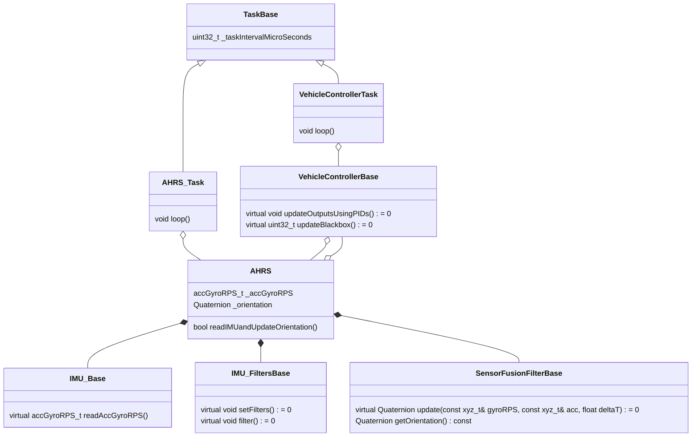
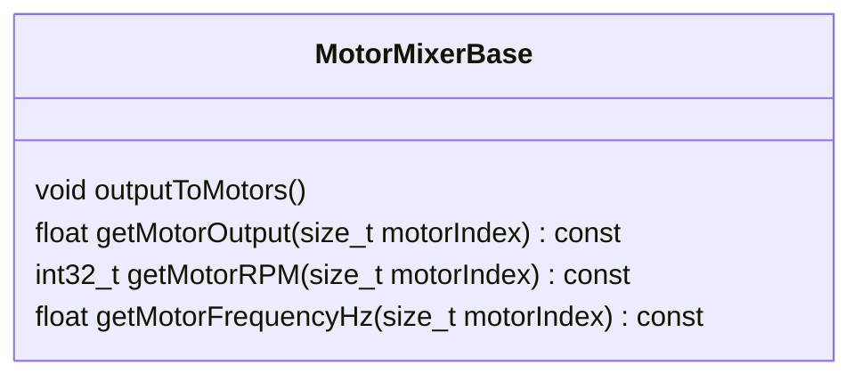

# Stabilized Vehicle Library  

This library contains a number of classes that can be the basis for a stabilized vehicle, such as a self-balancing robot or an aircraft.

## StabilizedVehicle Classes

### MotorMixer

