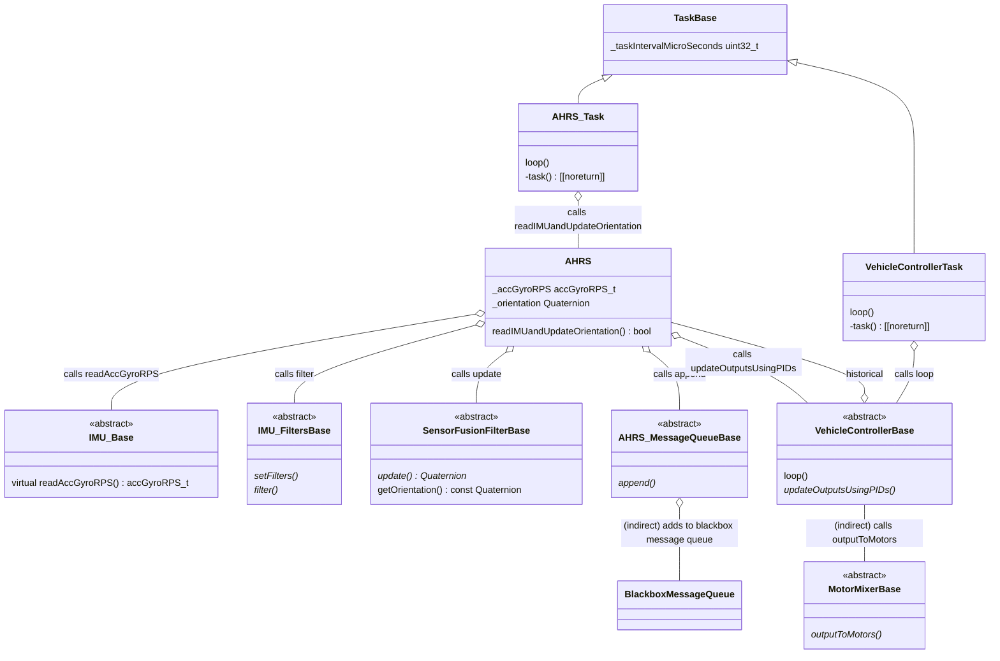

# Stabilized Vehicle Library  

This library contains a number of classes that can be the basis for a stabilized vehicle, such as a self-balancing robot or an aircraft.

## Simplified Class Diagram

The main work of the `AHRS_Task` is done in the `AHRS::readIMUandUpdateOrientation` function. 
This reads the IMU, filters the reading, applies sensor fusion, updates the blackbox, and then calls `VehicleControllerBase::updateOutputsUsingPIDs`.

`updateOutputsUsingPIDs` uses the PID controllers to calculate the new motor outputs.

The `VehicleController_Task` reads these calculated motor values and outputs them to the motors, via the `MotorMixer`.

